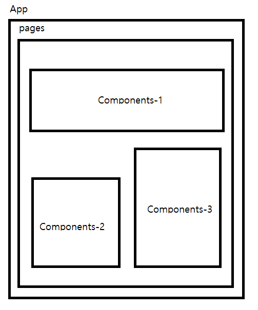

### 설치 라이브러리 목록
    - Vite
    - Typescript
    - framer-motion
    - Zustand
    - Tailwind
    - axios

### 페이지 / 컴포넌트파일 / 경로 설정 완료
    - 구조 예시
    

### 메인 글꼴 / 배경 / 글자색
    - 글꼴 : 
        1. 제목 : 세종병원체 https://noonnu.cc/font_page/1288
        2. 카드 & 본문 & 태그 : 프리텐다드 => 기본으로 설정 해둠
        3. 디테일 타이틀 : 태백
    - 배경색 : #232323
    - 글자색 : white